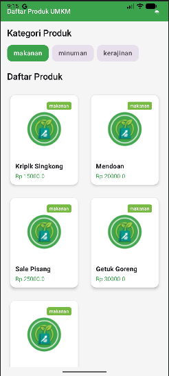
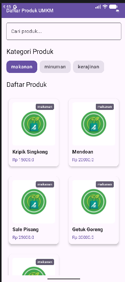
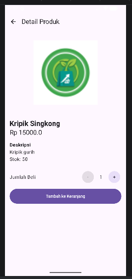
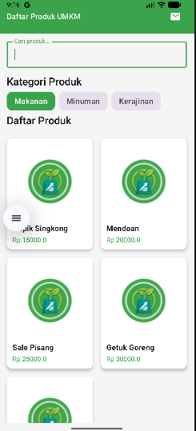
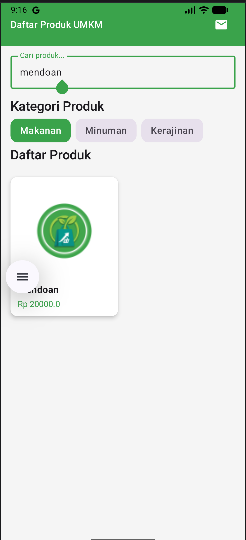
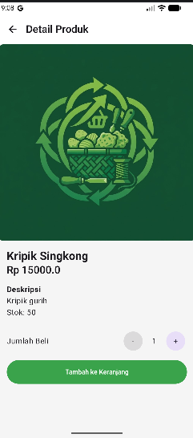

# Laporan Praktikum Pemrograman Mobile

| | |
|---|---|
| **Nama** | Fariz Rahman Syahida |
| **NIM** | H1D024008 |
| **Shift** | Awal F / Akhir C |
| **Praktikum** | Pemrograman Mobile |

**Daftar Isi:** [Pertemuan 1](#pertemuan-1) | [Pertemuan 2](#pertemuan-2) | [Pertemuan 3](#pertemuan-3) | [Pertemuan 4](#pertemuan-4)

---

## Pertemuan 1
**Tanggal**: Selasa, 1 September 2026

**Kesimpulan:**
Pertemuan pertama memberikan pemahaman dasar tentang pengembangan aplikasi mobile. Mahasiswa mengenali struktur proyek dan alur kerja, serta pentingnya konsistensi penulisan kode agar aplikasi mudah dikembangkan dan dipelihara.

---

## Pertemuan 2
**Tanggal**: Selasa, 8 September 2026

**Kesimpulan:**
Pertemuan kedua menekankan fitur interaktif. Mahasiswa belajar menghubungkan antarmuka dengan logika program sehingga aplikasi dapat merespons input pengguna secara dinamis.

---

## Pertemuan 3
**Tanggal**: Selasa, 15 September 2026

**Kesimpulan:**
Pertemuan ketiga membahas aplikasi yang lebih kompleks. Mahasiswa belajar mengintegrasikan berbagai komponen dan fitur untuk membuat aplikasi yang lebih lengkap.

---

## Pertemuan 4
**Tanggal**: Selasa, 22 September 2026  
**Topik:** Recomposition dan UI Lifecycle

[Tugas Pertemuan 4]

**Yang dikerjakan:**
- Form **Hubungi Kami**: dropdown tipe pesan, checkbox persetujuan, unggah gambar (photo picker), dan validasi input.
- **Daftar Produk**: search bar yang terintegrasi dengan filter kategori, serta indikator loading memakai `LaunchedEffect`.
- **Detail Produk**: pengaturan jumlah beli dan navigasi antar layar dengan `NavHost`.

**Kesimpulan:**
Pertemuan keempat memperkenalkan *state*, *recomposition*, dan *state hoisting* dengan pola *Unidirectional Data Flow*, yaitu data mengalir ke bawah dan *event* mengalir ke atas lewat lambda. Pemisahan *stateful* dan *stateless composable* membuat UI lebih mudah diuji dan dipakai ulang, sedangkan `LaunchedEffect` dan `delay` menunjukkan cara menjalankan proses asinkron tanpa membuat UI macet.

[Tugas Pertemuan 5]

**Yang dikerjakan:**
- **Pembersihan & Izin**: Menghapus data *dummy*, menambahkan izin `INTERNET`, serta mengatur `BASE_URL` dan dependensi (Retrofit, Gson, Coil).
- **Network & ViewModel**: Membuat `ApiInterface`, `ApiClient`, dan `ProductViewModel` menggunakan Coroutines untuk mengunduh data produk dan kategori.
- **UI State & Tampilan**: Menerapkan `ProductUiState` (`Loading`, `Success`, `Error`) dengan `StateFlow`, mengganti gambar dengan `AsyncImage` (Coil), dan mengintegrasikan status jaringan ke tampilan layar.

**Kesimpulan:**
Pertemuan kelima berhasil menerapkan integrasi REST API dan arsitektur MVVM, sehingga data dan gambar dimuat secara dinamis dari server dengan penanganan UI state yang reaktif.